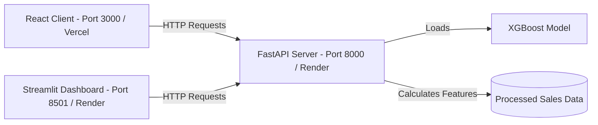

# Production Deployment Guide

Welcome to the Olist Sales Forecasting Deployment Guide. This repository is configured for modern production environments using Docker, Docker Compose, Render, Vercel, and GitHub Actions.

---

## 🗺️ Project Architecture



---

## 📂 Deployment Configuration Files

| Target Platform | Configurations | Documentation |
| :--- | :--- | :--- |
| **Docker Compose** | `docker-compose.yml`, `.dockerignore` | [Docker Guide](file:///c:/Users/khali/Downloads/depi/Olist/docs/Docker_Guide.md) |
| **Render** | `render.yaml`, `src/api/Dockerfile`, `src/dashboard/Dockerfile` | [Render Deployment](file:///c:/Users/khali/Downloads/depi/Olist/docs/Render_Deployment.md) |
| **Vercel** | `frontend/vercel.json`, `frontend/Dockerfile` | [Vercel Deployment](file:///c:/Users/khali/Downloads/depi/Olist/docs/Vercel_Deployment.md) |
| **Streamlit Cloud** | `requirements.txt`, `.streamlit/config.toml` | [Streamlit Deployment](file:///c:/Users/khali/Downloads/depi/Olist/docs/Streamlit_Deployment.md) |
| **CI/CD** | `.github/workflows/devops.yml` | - |
| **Config** | `.env.example` | [Environment Variables](file:///c:/Users/khali/Downloads/depi/Olist/docs/Environment_Variables.md) |

---

## 🚀 Quick Local Run (Docker Compose)

Start the whole stack (Backend + React Frontend + Streamlit Dashboard) in one command:
```bash
docker-compose up --build -d
```
Visit:
* React Frontend: [http://localhost:3000](http://localhost:3000)
* Streamlit Dashboard: [http://localhost:8501](http://localhost:8501)
* FastAPI Health Check: [http://localhost:8000/health](http://localhost:8000/health)
