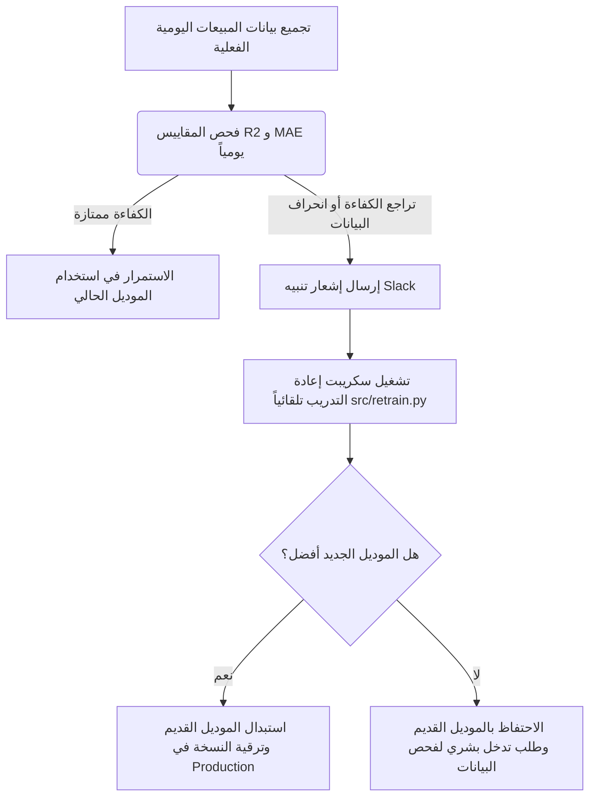

# دليل إعداد مراقبة النموذج وتتبع انحراف البيانات (Monitoring & Data Drift Setup)

يهدف هذا الدليل إلى توضيح كيفية مراقبة كفاءة نموذج توقع مبيعات Olist في بيئة التشغيل الفعلي (Production)، واكتشاف انحراف البيانات (Data Drift/Concept Drift)، وتحديد آلية إرسال التنبيهات التلقائية عند تراجع أداء النموذج.

---

## 1. المفاهيم الأساسية لمراقبة النماذج

في أنظمة التعلم الآلي التشغيلية، تتغير كفاءة النماذج بمرور الوقت بسبب تغير سلوك المستخدمين أو الظروف المحيطة. ينقسم هذا التغير إلى نوعين رئيسيين:

* **انحراف البيانات (Data Drift)**: تغير في التوزيع الإحصائي للميزات المدخلة للنموذج (Features). على سبيل المثال، زيادة مفاجئة في عدد المستخدمين النشطين أو تغير طبيعة المنتجات الأكثر مبيعاً.
* **انحراف المفهوم (Concept Drift)**: تغير في العلاقة بين الميزات المدخلة والهدف المراد توقعه (Total Sales). على سبيل المثال، حدوث تضخم مالي مفاجئ يؤدي لتغير مستويات الصرف رغم ثبات سلوك المستخدمين.

---

## 2. قياس دقة النموذج بعد تحقق المبيعات الفعلية

لقياس دقة النموذج، يتم تطبيق الخطوات التالية يومياً:

1. **تسجيل التوقعات (Prediction Logging)**: نقوم بحفظ التوقعات الصادرة عن الـ API في قاعدة بيانات المراقبة أو في ملف سجلات (e.g. `predictions_log.csv`) يحتوي على:
   * `timestamp`: وقت إصدار التوقع.
   * `target_date`: التاريخ المستهدف بالتوقع.
   * `predicted_sales`: القيمة التي توقعها النموذج.
2. **جلب البيانات الفعلية (Actuals Retrieval)**: عند نهاية كل يوم وتوفر المبيعات الحقيقية، يتم جلب إجمالي المبيعات الفعلية (`actual_sales`).
3. **المقارنة وحساب المقاييس (Evaluation)**: نقوم بدمج التوقعات مع المبيعات الفعلية وحساب مقاييس الأداء على نافذة زمنية متحركة (Sliding Window) تبلغ **30 يوماً**:
   * **متوسط الخطأ المطلق (MAE)**: يوضح متوسط الانحراف بالدولار.
   * **جذر متوسط مربعات الخطأ (RMSE)**: يعاقب الأخطاء الكبيرة بشكل أكبر.
   * **معامل التحديد ($R^2$ Score)**: يقيس مدى قدرة النموذج على تفسير التباين في البيانات الفردية (يجب أن يكون قريباً من 1.0).

---

## 3. آلية التنبيه وعتبات التراجع (Alerting Thresholds)

يتم ضبط نظام التنبيهات البرمجي ليقوم بإرسال إشعارات فورية لمهندسي البيانات في الحالات التالية:
1. **انخفاض معامل التحديد ($R^2$)**: إذا انخفضت قيمة $R^2$ عن **0.60** على مدار النافذة المتحركة لآخر 30 يوماً.
2. **ارتفاع الخطأ المطلق (MAE)**: إذا ارتفعت قيمة MAE بنسبة تفوق **20%** مقارنة بالدقة المرجعية للموديل أثناء مرحلة التدريب الأولى (Baseline validation MAE البالغة تقريباً $5,830).

### كود برمجى مقترح لفحص الانحراف وإرسال تنبيهات (Drift Check Script)

يمكن جدولة السكريبت التالي ليعمل يومياً (على سبيل المثال عبر Cron Job أو Airflow) لفحص كفاءة النموذج وإرسال إشعار إلى Slack أو البريد الإلكتروني:

```python
import pandas as pd
import numpy as np
from sklearn.metrics import mean_absolute_error, r2_score
import requests
import json

# إعدادات التنبيهات
SLACK_WEBHOOK_URL = "https://hooks.slack.com/services/YOUR/WEBHOOK/URL"
R2_THRESHOLD = 0.60
MAE_BASELINE = 5830.0
MAE_ALERT_MULTIPLIER = 1.20 # زيادة بنسبة 20%

def send_slack_alert(message):
    """إرسال إشعار فوري إلى قناة المتابعة في Slack."""
    payload = {"text": f"🚨 *تنبيه مراقبة النموذج (Model Monitoring Alert)* 🚨\n{message}"}
    try:
        response = requests.post(SLACK_WEBHOOK_URL, json=payload, timeout=5)
        if response.status_code == 200:
            print("Alert sent successfully to Slack.")
    except Exception as e:
        print(f"Failed to send Slack alert: {e}")

def monitor_model_performance(actuals_path, predictions_log_path):
    # تحميل التوقعات والبيانات الفعلية لآخر 30 يوماً
    actuals = pd.read_csv(actuals_path, parse_dates=['order_purchase_timestamp'])
    predictions = pd.read_csv(predictions_log_path, parse_dates=['target_date'])
    
    # دمج البيانات بناءً على التاريخ
    df_eval = pd.merge(
        actuals, 
        predictions, 
        left_on='order_purchase_timestamp', 
        right_on='target_date', 
        how='inner'
    )
    
    # تصفية البيانات لآخر 30 يوماً فقط
    last_30_days = df_eval['order_purchase_timestamp'].max() - pd.Timedelta(days=30)
    df_eval_30 = df_eval[df_eval['order_purchase_timestamp'] >= last_30_days]
    
    if len(df_eval_30) < 15:
        print("Not enough data points in the last 30 days to calculate stable metrics.")
        return
        
    # حساب المقاييس
    y_true = df_eval_30['total_sales']
    y_pred = df_eval_30['predicted_sales']
    
    mae = mean_absolute_error(y_true, y_pred)
    r2 = r2_score(y_true, y_pred)
    
    print(f"Sliding 30-day Metrics -> MAE: {mae:.2f}, R2: {r2:.2f}")
    
    # التحقق من الشروط وإرسال التنبيهات
    alerts = []
    if r2 < R2_THRESHOLD:
        alerts.append(f"• تراجع معامل التحديد (R² Score): الحالي {r2:.2f} وهو أقل من الحد الأدنى المقبول {R2_THRESHOLD:.2f}.")
        
    if mae > (MAE_BASELINE * MAE_ALERT_MULTIPLIER):
        alerts.append(f"• ارتفاع قيمة الخطأ (MAE): الحالي ${mae:,.2f} ويتجاوز الحد المقبول بـ 20% (${MAE_BASELINE * MAE_ALERT_MULTIPLIER:,.2f}).")
        
    if alerts:
        alert_msg = "\n".join(alerts)
        send_slack_alert(f"*انحراف في كفاءة النموذج المكتشف:*\n{alert_msg}\n\n👉 يرجى تشغيل سكريبت إعادة التدريب التلقائي: `python -m src.retrain`")
    else:
        print("Model performance is healthy.")

if __name__ == "__main__":
    # تشغيل الفحص (مثال على مسارات الملفات)
    # monitor_model_performance("data/processed/time_series_sales.csv", "data/monitoring/predictions_log.csv")
    pass
```

---

## 4. دورة إعادة التدريب التلقائي (Automated Retraining Loop)

لمعالجة تراجع الكفاءة وانحراف البيانات بشكل تلقائي، يتم تكامل النظام على النحو التالي:



### جدولة التشغيل (Scheduling):
* **إعادة التدريب الدوري (Scheduled Retraining)**: يفضل جدولة تشغيل سكريبت `src/retrain.py` بشكل أسبوعي (مثلاً كل يوم سبت في منتصف الليل) لدمج مبيعات الأسبوع الجديد وتحديث الأوزان.
* **إعادة التدريب الطارئ (Event-driven Retraining)**: يتم تشغيل عملية إعادة التدريب تلقائياً فور إرسال تنبيه انحراف الأداء من نظام المراقبة.
* **أدوات الجدولة المقترحة**:
  1. **Task Scheduler (Windows)**: لبيئة العمل المحلية للمستخدم.
  2. **Cron Jobs (Linux)**: للبيئات السحابية البسيطة.
  3. **Apache Airflow / Prefect**: لإدارة خطوط نقل البيانات المعقدة في المؤسسات.
